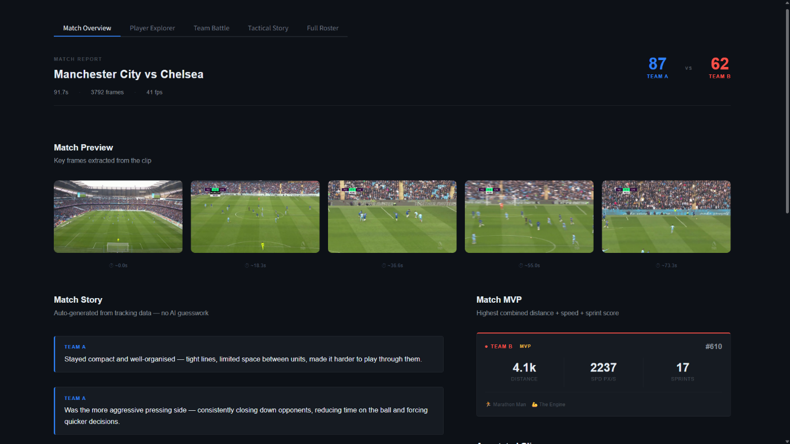
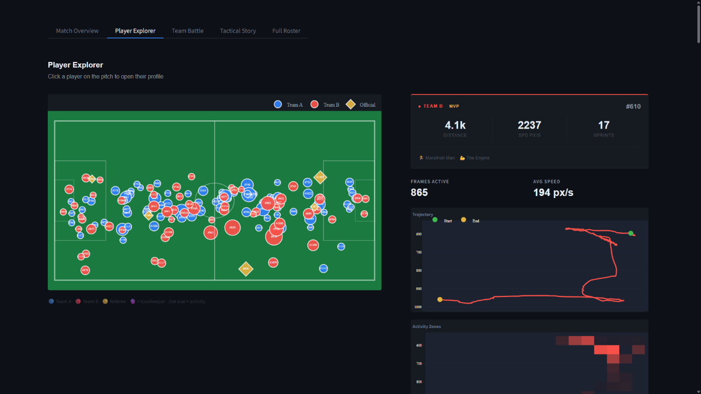
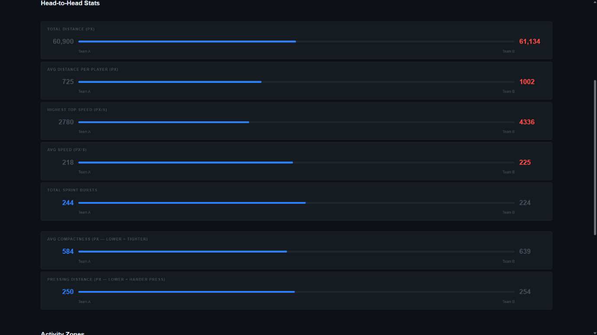
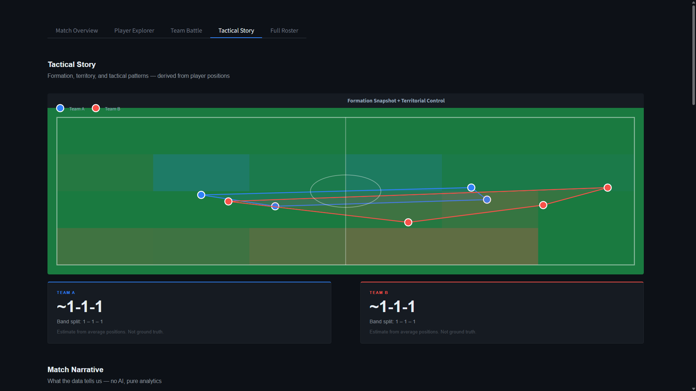
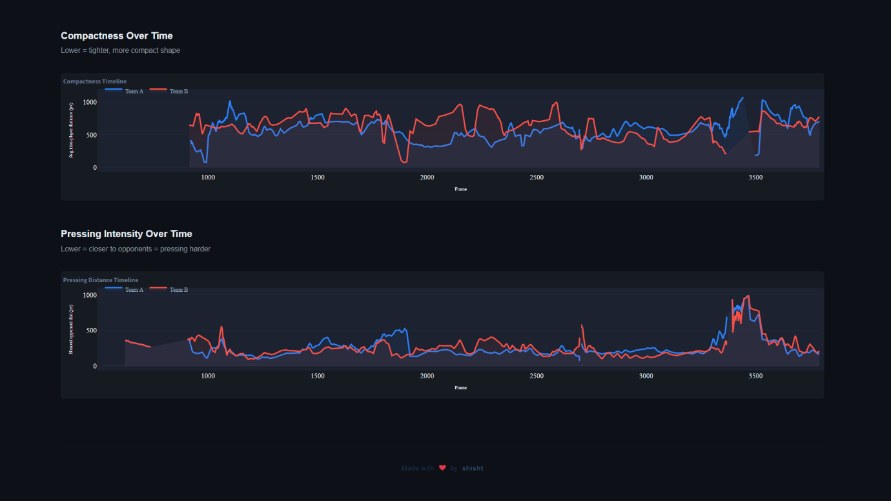
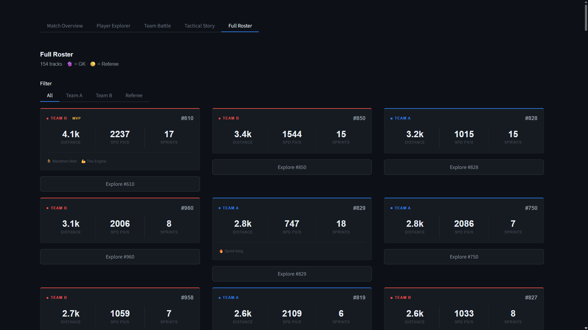
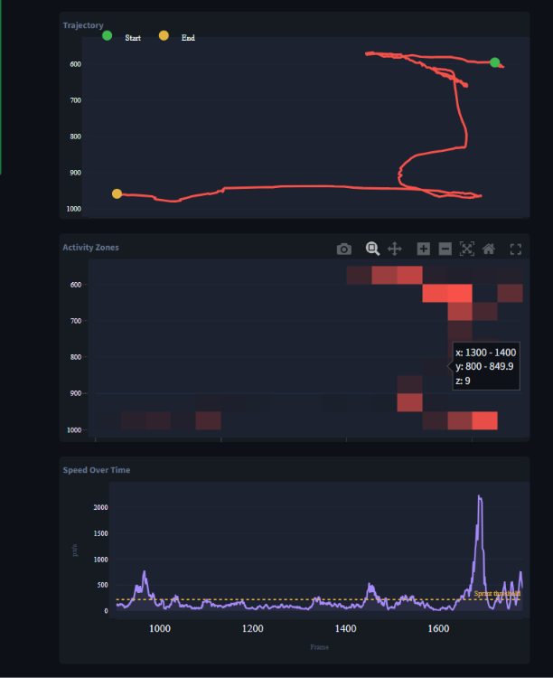

# TacticScope v2.0 — Match Intelligence Platform

> Upload a football clip. Get player tracking, team classification, speed analysis, and tactical insights — all in a sleek dark UI.

Built with **YOLOv8 + ByteTrack + Streamlit**.

---

## Features

| Module | What it does |
|---|---|
| 🔍 **Detection & Tracking** | YOLOv8n detects players, ByteTrack assigns persistent IDs |
| 👕 **Team Classification** | K-means on jersey colours splits players into Team A / Team B / Officials |
| ⚡ **Speed Estimation** | Per-player speed (px/s), top speed, sprint count |
| 🧠 **Tactical Insights** | Compactness, pressing intensity, territorial control, formation snapshots, key moments |
| 📊 **Dashboard** | 5-view Streamlit app: Match Overview, Player Explorer, Team Battle, Tactical Story, Full Roster |

---

## Screenshots

### Home Page


### Match Overview
Score, key-frame previews pulled from the clip, and an auto-generated match story — "no AI guesswork," just tracking data.



### Player Explorer
Click any player on the pitch to pull up their live stats, trajectory, and activity-zone heatmap.



### Team Battle
Head-to-head comparison across total distance, top speed, average speed, sprint bursts, compactness, and pressing distance.



### Tactical Story
Estimated formation and territorial control, derived purely from average player positions — plus compactness and pressing intensity tracked frame-by-frame across the match.




### Full Roster
All 154 tracked players in a match, filterable by team, goalkeeper, or referee.



### Player Deep Dive
Per-player trajectory, activity-zone heatmap, and speed-over-time chart with sprint threshold marked.



---

## Quick Start

```bash
# 1. Clone
git clone https://github.com/shisht04/TacticScope.git
cd TacticScope

# 2. Create venv + install deps
python -m venv venv
venv\Scripts\activate        # Windows
# source venv/bin/activate   # macOS/Linux

pip install -r requirements.txt

# 3. Run
streamlit run app.py
```

Then open `http://localhost:8501` and upload a short football clip (10–20 sec, 720p+).

> **Note:** YOLOv8n weights (`yolov8n.pt`) auto-download on first run (~6 MB). Needs internet access once.

---

## Project Structure

```
tacticscope/
├── app.py                  # Streamlit app (all 5 views)
├── requirements.txt
├── assets/                 # README screenshots
├── tests/
│   ├── test_pipeline.py    # Pytest test suite (one test per pipeline stage)
│   └── check_v2.py         # Manual smoke-test script
├── data/
│   ├── videos/             # Put your input clips here (.gitkeep included)
│   └── output/             # Generated files land here (.gitkeep included)
└── src/
    ├── detect_and_track.py  # Step 1: YOLOv8 + ByteTrack
    ├── analytics.py         # Step 2: Trajectories, distance, heatmaps
    ├── team_classifier.py   # Step 3: Jersey colour k-means
    ├── speed_estimator.py   # Step 4: Speed + sprint detection
    └── tactical_insights.py # Step 5: Compactness, pressing, formation
```

---

## Running Tests

Tests require pipeline output to exist first (run `detect_and_track.py` once):

```bash
python src/detect_and_track.py --video data/videos/sample.mp4
python -m pytest tests/test_pipeline.py -v
```

---

## Tech Stack

- **Detection**: [Ultralytics YOLOv8n](https://github.com/ultralytics/ultralytics) (COCO person class)
- **Tracking**: ByteTrack (via `model.track()`)
- **Clustering**: scikit-learn KMeans (k=3: Team A, Team B, Officials)
- **Dashboard**: Streamlit 1.60.0 with Plotly — provides `st.pills`, `st.html`, `st.segmented_control`
- **Speed**: Pixel-space px/s with rolling smoothing (real-world km/h needs homography calibration — noted as stretch goal)

---

## Known Limitations

- **ID switches**: Occlusion or crossing paths can reset a player's track ID — this is a known limitation of detection-based tracking (no ReID).
- **Pixel units**: Speed/distance are in pixels, not metres. Rankings are still valid relatively.
- **Team classifier**: Works best when teams have clearly different jersey colours. k=3 separates officials automatically.
- **CPU speed**: ~2–5 FPS on CPU for yolov8n — keep demo clips ≤ 20 sec.

---

## Future Work

### Appearance-based Re-Identification (ReID)

The current ID-switch limitation is the most impactful unsolved problem in the pipeline.

When two players cross paths or one is briefly occluded, ByteTrack can assign a new track ID to a player it already knew about — because the matching relies on bounding box overlap (IoU), not on what the player looks like. The result: one real player appears as two separate track IDs in the analytics, which inflates track counts and splits trajectories/stats.

The concrete next step would be to integrate an **appearance-based Re-Identification model** alongside ByteTrack:

- **Approach**: Use a lightweight OSNet-based ReID model (e.g. from [torchreid](https://github.com/KaiyangZhou/deep-person-reid)) to extract a feature embedding from each detected player crop, then match new detections to existing tracks by combining IoU *and* embedding similarity. When IoU fails, the appearance vector can still close the association.
- **Integration point**: `src/detect_and_track.py` — after the ByteTrack assignment step, add a ReID re-association pass over "lost" tracks before they are marked as new IDs.
- **Expected impact**: Significantly fewer spurious track ID splits in long clips or clips with dense player interaction. Downstream stats (distance, speed, formation) would reflect individual players more accurately.

This is **future work** — it is not currently implemented in this codebase.

---

## Results / Sample Output

> Sample run on a Manchester City vs Chelsea highlight clip.

| Metric | Sample Value |
|---|---|
| Players tracked (Team A) | 84 |
| Players tracked (Team B) | 61 |
| Officials detected | 9 |
| Top speed (px/s) | 4336 |
| Average speed (px/s) | 218 (Team A) / 225 (Team B) |
| Sprint bursts (Team A) | 244 |
| Sprint bursts (Team B) | 224 |
| Estimated formation — Team A | ~1-1-1 |
| Estimated formation — Team B | ~1-1-1 |
| Key tactical moments detected | TBD |
| Clip duration analysed | 91.7 sec |
| Processing time (CPU) | TBD |

---

## NOTE

Because this demo clip used broadcast (TV-style) footage rather than a fixed tactical camera, frequent camera cuts and player occlusion inflated track counts well above the real 22 on-pitch players.It is a direct symptom of the ID-switch limitation described above, which the planned ReID integration is meant to fix.
---

Made with ❤️ by shisht
